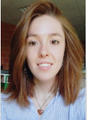
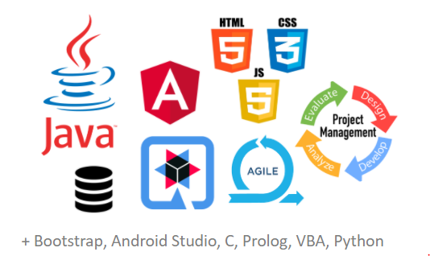

|  |  Etudiante en M1 MIAGE à l'université de Nantes   Motivée, dynamique, efficace et responsable      Je suis à la recherche d’une alternance afin de terminer mes études dans l’accompagnement à la gestion du changement. |

### Table des matières 

- [Informations générales](#informations-générales) 
- [Expériences professionnelles](#expériences-professionnelles) 
- [Expériences associatives](#expériences-associatives) 
- [Formation](#formation) 
- [Compétences informatiques](#compétences-informatiques) 
- [Interêts ](#interêts) 
- [International](#international) 
- [Contactez-moi ! ](#contactez-moi-!) 

### Informations générales
-  France (Nantes – 44 000)
-  Permis B 
-  21 ans

### Expériences professionnelles

Septembre 2019/ Septembre 2021
:   **DSI PÔLE EMPLOI**, Nantes (44000) 
- Développeur Web en alternance
> ⇒ Collaborer avec une équipe vers un objectif commun 
> 
> ⇒ S’adapter à l’environnement de travail

Avril / Juin 2019
:   **Stage d’informatique**, Moscou (Russie)
- Réalisation d’un site avec Spring et Bootstrap
> ⇒ Gérer les changements

Octobre 2018/Février 2019
:   **LECLERC DRIVE**; Blagnac (31700)
- Préparatrice de commandes
> ⇒ Résister au stress

Septembre/Octobre 2018
:   **PROHYGIENE**; Toulouse (31000)
- Femme de ménage
> ⇒ Travailler efficacement 

Été 2017
:   **WALIBI SUD-OUEST**, Rochefort 
- Agent polyvalent, principalement en restauration
> ⇒  Etre responsable et autonome

[Haut de la page](#table-des-matières) 

### Expériences associatives

2020/2021
:   **Association Nantaise des Étudiants de Miage (ANEM)**; Nantes (44000)
- Responsable Pôle Événementiel et Communication
> ⇒ Communiquer de façon adéquate pour entreprendre et fédérer un groupe

Décembre 2020
:   **Programme Ré_action**; MAKESENSE
- Participation  au “Lien avec nos aînés”
> ⇒ Être à l’écoute et attentive
	
2019/2020
:   **ANEM**; Nantes (44000)
- Organisatrice d’évènements
> ⇒ Organiser et planifier des projets

Été 2019
:   **Bénévole au Festival Interceltique**; Lorient (56100)
- Stand de Prévention
> ⇒ Aider, prévenir, être avenante

Été 2018
:   **Expérience de WOOFING**; Irlande
- Jardinière, aide ménagère
> ⇒ Améliorer sa capacité d’adaptation

[Haut de la page](#table-des-matières)

### Formation

2020-2021
:   **M1 Méthodes Informatiques Appliquées à la Gestion d'Entreprises (MIAGE)**; Université de Nantes

Été 2020 
:   **Obtention 1ère étape du BAFA**; UCPA
> Animer, organiser des évènements

2019-2020
:   **L3 MIAGE**;  Université de Nantes
- 5ème de promotion alternance
> ⇒ Gérer le rythme soutenu
     
2017-2019 
:   **DUT INFORMATIQUE**; Université de Toulouse, Blagnac
> ⇒ Apprendre efficacement

2015-2017
:   **Baccalauréat Economique et Social (ES)**; Lycée Bernard PALISSY, Agen 
- Mention Assez Bien

[Haut de la page](#table-des-matières)

### Compétences informatiques

### Interêts
-  Monde associatif
-  Chant 
-  Guitare 
-  Lecture 
-  Voyage 
-  Développement personnel 

### International
-  Français : Maternel 
-  Anglais : B1
	- Pratiqué pendant 2 mois en Russie [ Voir 'Expériences professionnelles'](#expériences-professionnelles) 
	- Pratiqué pendant 2 mois en Irlande [ Voir 'Expériences associatives'](#expériences-associatives) 

### Contactez-moi !  [Profil Linkedin ](https://www.linkedin.com/in/m%C3%A9lissa-m%C3%A9rat-9b9379173/) 

[Haut de la page](#table-des-matières)
